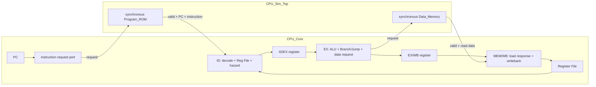
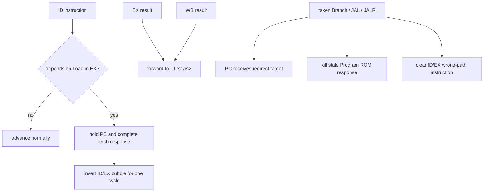

# RV32I 四級管線 CPU

這是一個以 SystemVerilog 從零實作的教學型 RV32I CPU。專案目前使用同步 Instruction Memory 與同步 Data Memory，包含 forwarding、load-use stall、control-flow flush、安全的非法指令處理，以及可逐條比對 architectural effects 的退休（retire）介面。

目前設計適合用來學習 CPU datapath、pipeline control 與驗證方法；它還不是可直接 tape-out 的完整 RISC-V SoC。

RV32I Core v1.0 的完整 ISA、reset、memory、trap 與 retire 契約，以及 40 條指令的逐項驗證矩陣，請見 [`docs/rv32i-core-spec.md`](docs/rv32i-core-spec.md)。該文件描述最終 v1.0 目標；本 README 描述目前已實作狀態。

## 快速開始

開發環境：

- Windows：編輯程式與瀏覽 `index.html`
- WSL：執行 Bash、Icarus Verilog 與測試
- 必要命令：`iverilog`、`vvp`、`python3`
- 程式映像流程另需 RISC-V GNU bare-metal toolchain：`riscv64-unknown-elf-gcc`、`objcopy`、`objdump`、`readelf`、`nm`

在 WSL 中進入專案：

```bash
cd /mnt/d/CodeProject/cpu_build
```

完成下方 ACT4 環境準備後，執行包含 architectural tests 的完整回歸：

```bash
./run_tests.sh all
```

只執行退休 trace 測試：

```bash
./run_tests.sh retire
```

從 Assembly 建立 ELF/HEX 並執行映像整合測試：

```bash
./run_tests.sh image
```

執行 ACT4 產生的完整 RV32I architectural regression：

```bash
./run_tests.sh arch
```

編譯並執行代表性 freestanding C workload：

```bash
./run_tests.sh compiled
```

這個 workload 沿用 ACT4 的統一記憶體與 pass/fail testbench，驗證 nested function call/return、stack frame、`.data` 初始化、`.bss` 清零、陣列複製及 branch-heavy loop。腳本會執行兩次並要求 cycle/retired count 完全一致。

其中 `./run_tests.sh image` 會以 `-march=rv32i -mabi=ilp32` 編譯
`programs/image_smoke.S`，產生 ELF、map、objdump、section/symbol report、
IMEM/DMEM HEX，驗證彼此一致後再啟動 CPU simulation。產生的檔案位於
`build/programs/image_smoke/`。

測試成功時 process exit code 為 `0`，並印出 `[PASS]`。整合測試產生的 VCD waveform 位於 `build/`。

若 WSL 尚未安裝 Icarus Verilog，在 Ubuntu／Debian 環境可使用：

```bash
sudo apt update
sudo apt install iverilog
```

## 驗證總覽

目前驗證不是只靠單一程式，而是由「模組單元測試 → pipeline 整合測試 → golden retire trace → 自建程式映像 → RV32I directed matrix → ACT4 architectural tests → freestanding C 程式」逐層建立信心。所有自動測試失敗時都會呼叫 `$fatal` 或讓腳本回傳非零 exit code；成功時輸出 `[PASS]`。

| 驗證層級 | 實作方式 | 主要驗證內容 | 執行入口 |
|---|---|---|---|
| RTL 模組單元測試 | 每個模組使用獨立 SystemVerilog testbench，直接驅動輸入並逐項比對輸出、reset 與時序 | PC、Register File、immediate decode、ALU、pipeline registers、Control、forwarding、hazard、Branch、Load/Store 與 memory byte enable | `bash run_tests.sh pc`、`alu`、`control`、`memory` 等 |
| Pipeline/CPU 整合測試 | testbench 將短程式載入 `Program_ROM`，觀察 register、memory、redirect、stall、flush 與退休事件 | I/R/U-type、Branch、JAL/JALR、Load/Store、load-use stall、forwarding、wrong-path side effect | `cpu`、`branch`、`jal`、`jalr`、`load`、`store`、`loadhazard`、`hazard` |
| Precise trap 與特殊指令 | 分別測試 trap detector、pending/ack unit 及 CPU 整合；檢查 cause/PC/tval、faulting instruction 不退休且沒有副作用 | illegal instruction、FENCE、ECALL、EBREAK、instruction/load/store misalignment、trap metadata 穩定性與 redirect | `trapdetect`、`trapunit`、`cputrap`、`illegal`、`fence`、`system`、`alignment` |
| Golden retire trace | 固定程式的每筆 `retire_pc`、instruction、register write 與 Store metadata 依序和 golden trace 比對 | retirement 順序、Load/Store、hazard、control-flow、wrong-path suppression 與 precise trap | `bash run_tests.sh retire` |
| Assembly/ELF/HEX 映像 | GNU toolchain 產生 ELF；`objcopy` 拆出 `.text/.data`，Python 轉成 little-endian word HEX，再由 `$readmemh` 載入 CPU | entry point、section/address、endianness、映像內容、同步 IMEM/DMEM 及程式執行結果 | `bash run_tests.sh image` |
| RV32I directed matrix | CSV 將 40 條 RV32I 指令連到 positive/corner/pipeline/trap evidence；腳本先檢查矩陣，再編譯並執行 ordered assembly workload | 40/40 指令可追溯性、38 條正常退休指令、FENCE、EBREAK、redirect 與 golden signature | `bash run_tests.sh directed` |
| ACT4 architectural tests | UDB 描述 DUT 能力，Sail 產生 expected signature；ACT4 建立 self-checking ELF，轉成稀疏 unified-memory HEX，再於 RTL 監看 `tohost`、trap 與 timeout | 官方目前適用的 39 項 RV32I I-extension tests；目前結果 `39/39 PASS` | `bash run_tests.sh arch` |
| 編譯程式驗證 | freestanding startup 設定 stack、清 `.bss` 並呼叫 C `main`；C 程式自行比對 signature，runner 同時稽核反組譯並連跑兩次 | nested call/return、32-byte stack frame、`.data/.bss`、array copy、branch-heavy loop、無 RV32M/RVC/CSR/runtime dependency、執行可重現性 | `bash run_tests.sh compiled` |

### 各層如何判定通過

- 單元與 CPU testbench 直接比較預期值；任何 mismatch、額外 retire、錯誤 trap 或 timeout 都會 `$fatal`。
- `retire` 測試比較的是有順序的 architectural events，不依賴 pipeline 內部訊號，因此可以發現錯誤退休或 wrong-path side effect。
- `image` 測試同時比對 ELF header、sections、symbols、objdump、HEX 與 RTL 執行結果，避免「程式正確但映像位址或 endian 錯誤」。
- `directed` 測試要求 [`verification/rv32i-directed.csv`](verification/rv32i-directed.csv) 的 40 條指令都有實際 evidence，不能只因 opcode 曾出現就算覆蓋。
- ACT4 ELF 已包含 Sail 計算出的 expected result；RTL 執行後向 `0x01ff_fff0` 寫入 `1` 才算通過，寫入 `3`、unexpected trap 或 timeout 都算失敗。每項 log 保存在 `build/arch-test/rtl/logs/`。
- `compiled` 測試的 C workload 會自行比對五組 signature；腳本還會拒絕 compressed、RV32M、CSR、`mret`、`wfi` 或 unresolved runtime symbol。固定工具版本下連續兩次均為 `1304 cycles / 902 retired`。

目前最近一次完整驗收結果：既有 unit/integration/directed tests 全數通過、ACT4 `39/39 PASS`、compiled workload 兩次結果一致。ACT4 的設定、工具版本與歷次結果另見 [`verification/arch-test/README.md`](verification/arch-test/README.md)、[`tool-versions.txt`](verification/arch-test/tool-versions.txt) 與 [`regression-results.txt`](verification/arch-test/regression-results.txt)。

## 從新環境復刻驗證

以下以 Ubuntu 22.04 WSL、專案位置 `/mnt/d/CodeProject/cpu_build` 為例。其他路徑可以使用，但 ACT4 的 `test_config.yaml` 必須同步修改成該環境的絕對工具路徑。

### 1. 安裝一般 RTL 與程式映像工具

```bash
sudo apt update
sudo apt install git make curl python3 iverilog \
  gcc-riscv64-unknown-elf binutils-riscv64-unknown-elf
```

進入專案並確認工具：

```bash
cd /mnt/d/CodeProject/cpu_build
iverilog -V
python3 --version
riscv64-unknown-elf-gcc --version
```

本次驗收使用 Icarus Verilog 11.0、Python 3.10.12，以及一般程式映像流程使用的 `riscv64-unknown-elf-gcc` 10.2.0。較新的相容版本也可使用，但 cycle/retire 基線或編譯結果若改變，必須重新檢查 objdump，不能直接沿用舊數字。

### 2. 先復刻不依賴 ACT4 的驗證

```bash
bash run_tests.sh imagetools
bash run_tests.sh image
bash run_tests.sh directed
bash run_tests.sh retire
```

也可以用下列命令逐類定位問題：

```bash
bash run_tests.sh alu
bash run_tests.sh control
bash run_tests.sh memory
bash run_tests.sh loadhazard
bash run_tests.sh cputrap
bash run_tests.sh alignment
```

每條命令都應以 exit code `0` 結束，且最後出現 `[PASS]`。映像、objdump、map、symbol report 與 waveform 會保存在 `build/`。

### 3. 準備 ACT4、UDB、GCC 15 與 Sail

ACT4 使用另一組經鎖定的工具：riscv-arch-test commit `b664a56b7b24a0ba7512f8df064f9e799e33c892`、GCC 15.2.0/Binutils 2.45、Sail RISC-V 0.13.1、mise 2026.8.5。安裝位置可以不同，但需更新 [`verification/arch-test/test_config.yaml`](verification/arch-test/test_config.yaml) 的 `compiler_exe`、`objdump_exe` 與 `ref_model_exe`。

```bash
mkdir -p external
git clone --branch act4 https://github.com/riscv/riscv-arch-test.git \
  external/riscv-arch-test
git -C external/riscv-arch-test checkout \
  b664a56b7b24a0ba7512f8df064f9e799e33c892
```

安裝 `mise`，然後初始化 ACT4 的 Python/Ruby/UDB 環境：

```bash
curl https://mise.jdx.dev/install.sh | sh
export PATH="$HOME/.local/bin:$PATH"
cd external/riscv-arch-test
mise trust .mise.toml
mise install
cd /mnt/d/CodeProject/cpu_build
```

接著安裝 GCC 15.2.0/Binutils 2.45。ACT4 repository 的 README「RISC-V Compiler」章節包含從 `riscv-gnu-toolchain` 建置的完整相依套件與 configure 命令；本次安裝 prefix 為 `/opt/riscv/gcc-15.2.0`。建置可能耗時數小時，完成後再安裝 Sail 0.13.1：

```bash
mkdir -p "$HOME/.local/opt/sail-riscv-0.13.1"
curl --location \
  "https://github.com/riscv/sail-riscv/releases/download/0.13.1/sail-riscv-$(uname)-$(arch).tar.gz" \
  | tar xvz --directory="$HOME/.local/opt/sail-riscv-0.13.1" \
      --strip-components=1
```

確認 `test_config.yaml` 中的三條絕對路徑都可以執行：

```bash
/opt/riscv/gcc-15.2.0/bin/riscv-none-elf-gcc --version
/opt/riscv/gcc-15.2.0/bin/riscv-none-elf-objdump --version
/home/yuan/.local/opt/sail-riscv-0.13.1/bin/sail_riscv_sim --version
```

若安裝在其他位置，請以實際路徑替換上述命令與設定檔。完整版本紀錄位於 [`verification/arch-test/tool-versions.txt`](verification/arch-test/tool-versions.txt)。

### 4. 產生 ACT4 self-checking ELF

```bash
cd /mnt/d/CodeProject/cpu_build/external/riscv-arch-test
CONFIG_FILES=/mnt/d/CodeProject/cpu_build/verification/arch-test/test_config.yaml \
WORKDIR=/mnt/d/CodeProject/cpu_build/build/arch-test/act4 \
EXTENSIONS=I \
make --jobs "$(nproc)"
```

完成後應在下列目錄看到 39 個 `.elf`：

```text
build/arch-test/act4/cpu-build-rv32i/elfs/rv32i/I/
```

### 5. 執行 architectural 與 compiled-program regression

```bash
cd /mnt/d/CodeProject/cpu_build
bash run_tests.sh arch
bash run_tests.sh compiled
```

預期摘要：

```text
[SUMMARY] passed=39 failed=0 total=39
[ACT4 PASS] compiled_workloads cycles=1304 retired=902
[ACT4 PASS] compiled_workloads cycles=1304 retired=902
```

`compiled` 預設使用 `/opt/riscv/gcc-15.2.0/bin/riscv-none-elf-`。若 GCC 位於其他地方，可以指定 prefix：

```bash
RISCV_PREFIX=/your/toolchain/bin/riscv-none-elf- \
  bash run_tests.sh compiled
```

### 6. 執行最終完整回歸

```bash
cd /mnt/d/CodeProject/cpu_build
set -o pipefail
bash run_tests.sh all | tee build/full-regression.log
```

`all` 會包含 unit、integration、trap、image、directed、39 項 ACT4、compiled workload 與既有程式測試。判定方式是 shell exit code 必須為 `0`：

```bash
echo $?
```

若 ACT4 單項失敗，可只重跑一個 ELF 並查看保存的 log：

```bash
bash verification/arch-test/run_arch_tests.sh I-add-00.elf
less build/arch-test/rtl/logs/I-add-00.log
```

若需要逐筆退休資訊，可在 `verification/arch-test/run_arch_tests.sh` 呼叫 `vvp` 的位置暫時加入 `+TRACE`；一般 CPU integration test 的 VCD 則位於 `build/*.vcd`。

## Pipeline 架構

目前是四級、single-issue、in-order pipeline：



`Program_ROM` 的 response register 同時形成 fetch 與 ID 的邊界，因此 `CPU_Core` 不再實例化獨立 `IFID`。`IFID.sv` 仍保留單元測試，作為 pipeline register 練習與未來不同 memory latency 的備選元件。

`CPU_Core` 只包含 datapath、control、pipeline registers 與 Register File，透過明確的 instruction/data request-response ports 存取外部 memory。`CPU_Sim_Top` 接回現有 `Program_ROM` 與 `Data_Memory`；`CPU_Top` 只保留為舊介面的相容 wrapper。正式 synthesis 應以 `CPU_Core` 為 top。

### 每級職責

| Stage | 主要工作 |
|---|---|
| IF | PC 發出 request；同步 Program ROM 保存 response PC、instruction 與 valid |
| ID | 解碼、產生 immediate/control、讀 Register File、套用 EX/WB forwarding、偵測 load-use hazard |
| EX | ALU 運算、effective address、Branch/JAL/JALR redirect、Store data/byte-enable 產生 |
| MEM/WB | 接收同步 Load response、資料擴展與對齊檢查、統一 register writeback、輸出 retire event |

## Stall、forwarding 與 flush



- ALU/JAL/JALR 結果可由 EX 或 WB forwarding 回 ID。
- Load 在 EX 時只有 address，不能當成最終資料 forwarding。
- 緊鄰 Load consumer 會精確 stall 一個 cycle，並保持 PC 與完整 fetch response。
- redirect 優先於一般 PC hold；舊 response 會 invalid，wrong-path 指令不得產生副作用。

## Memory 介面

### Instruction Memory

`Program_ROM.sv` 是容量可參數化的可寫模擬模型，預設為 64 words：

- 一個 clock 的同步 response
- request 由 `fetch_en` 控制
- response 包含 `response_valid`、`response_pc`、`response_inst`
- `fetch_en=0` 時保持整份 response
- reset 或 `kill_response` 使 response invalid
- `kill_response` 與 fetch 同時發生時，kill 優先

一般 CPU 單元／整合 testbench 可在解除 reset 前直接載入
`CPU_Sim_Top.u_Program_Rom.memory[]`；正式程式映像測試則透過
`IMEM_INIT_FILE` 與 `$readmemh` 載入 build script 生成的 HEX。未來替換
SRAM IP 時，只需修改 wrapper 並維持相同 transaction contract，不需修改
`CPU_Core`。

### Data Memory

`Data_Memory.sv` 是容量可參數化的同步模型，預設為 4 KiB（1024 × 32-bit）：

- 同步 read 與 `read_valid`
- 同步 write
- 4-bit byte enable
- 支援 byte、halfword、word 存取

目前沒有 bus protocol、cache、MMU、memory protection 或 wait-state/backpressure。有效使用範圍是測試模型定義的低位址 memory window。

外部程式映像的正式 ELF/IMEM/DMEM 位址配置與 data rebase 規則記錄於 [`docs/program-image-memory-map.md`](docs/program-image-memory-map.md)。其中 ELF `.data` 使用 `0x1000_0000` 作為封裝 base，但 CPU runtime Data Memory 仍使用低 4 KiB offset。

## 支援的指令

目前 RTL 已實作 RV32I base 的 40 條指令，包含 FENCE、ECALL 與 EBREAK。

| 類型 | 指令 |
|---|---|
| I-type ALU | ADDI, SLTI, SLTIU, XORI, ORI, ANDI, SLLI, SRLI, SRAI |
| R-type ALU | ADD, SUB, SLL, SLT, SLTU, XOR, SRL, SRA, OR, AND |
| U-type | LUI, AUIPC |
| Branch | BEQ, BNE, BLT, BGE, BLTU, BGEU |
| Jump | JAL, JALR |
| Load | LB, LH, LW, LBU, LHU |
| Store | SB, SH, SW |
| Memory ordering | FENCE |
| System trap | ECALL, EBREAK |

未知 opcode 與保留 funct3/funct7 會產生 precise illegal-instruction trap；
faulting instruction 不退休且無 register/memory/control-flow side effect。

## Retire trace

`CPU_Top` 在統一的 EX/WB 觀察點提供：

| Signal | 意義 |
|---|---|
| `retire_valid` | 目前是否有一條合法、未被 flush 的指令退休 |
| `retire_pc` | 該指令的 PC |
| `retire_inst` | 原始 32-bit instruction |
| `retire_rd_write` | 是否真的修改非 x0 register |
| `retire_rd` | 目的 register |
| `retire_rd_data` | register write data |
| `retire_mem_write` | 是否真的提交 Store |
| `retire_mem_addr` | Store address |
| `retire_mem_data` | 已對齊的 Store data |
| `retire_mem_byte_enable` | Store byte lanes |

`tb_CPU_Retire.sv` 會將 12 筆 ordered retire events 與固定 golden trace
逐條比較，另驗證三筆 precise trap。測試包含 ALU、Load/Store、load-use
stall、taken Branch、JAL/JALR、LUI/AUIPC、wrong-path、非法指令及
misaligned access。

目前這是固定程式的 golden trace，不是可執行任意 ELF 的 Spike/QEMU 通用差分測試平台。

## RTL 模組

| 檔案 | 職責 |
|---|---|
| `rtl/CPU_Core.sv` | 可獨立合成的 datapath/control/register file；提供 instruction/data memory transaction ports 與 retire interface |
| `rtl/CPU_Sim_Top.sv` | simulation wrapper；實例化 CPU_Core、Program_ROM、Data_Memory 與集中式 debug helpers |
| `rtl/CPU_Top.sv` | 保留既有外部介面的相容 wrapper；內部轉接 CPU_Sim_Top |
| `rtl/PC.sv` | PC reset、hold 與 next-PC capture |
| `rtl/Program_ROM.sv` | 容量可參數化的同步 instruction response model；預設 64 words |
| `rtl/Inst_Decoder.sv` | instruction fields 與 I/S/B/U/J immediate |
| `rtl/Control_Unit.sv` | 指令合法性、ALU、operand、branch/jump、Load/Store controls |
| `rtl/Reg_File.sv` | 32 × 32-bit、雙讀單寫、x0 固定為零 |
| `rtl/IDEX.sv` | ID/EX payload、control、PC 與 instruction register |
| `rtl/EXWB.sv` | EX/WB result、memory、PC/instruction 與 retire metadata register |
| `rtl/ALU.sv` | 十種整數 ALU operation |
| `rtl/Branch_Unit.sv` | Branch comparison 與 JAL/JALR target |
| `rtl/Forwarding_Unit.sv` | EX/WB 到 ID 的 rs1/rs2 bypass |
| `rtl/Hazard_Unit.sv` | 精確 load-use dependency detection |
| `rtl/Data_Memory.sv` | 容量可參數化的同步 data memory model；預設 4 KiB |
| `rtl/Arch_Test_Memory.sv` | ACT4/compiled-program 專用的 32 MiB unified simulation memory |
| `rtl/Store_Unit.sv` | Store byte enable、data alignment 與 misalignment detection |
| `rtl/Load_Unit.sv` | Load extraction、sign/zero extension 與 misalignment detection |
| `rtl/Controller.sv` | reset 後的初始化 flush sequence |
| `rtl/IFID.sv` | 已驗證但目前未在 CPU Top 實例化的 IF/ID register |
| `rtl/defines.sv` | opcode、funct 與內部 control constants |

## 測試

`run_tests.sh` 支援以下測試名稱：

| 命令 | 內容 |
|---|---|
| `./run_tests.sh all` | 完整回歸 |
| `./run_tests.sh cpu` | I/R/U-type CPU integration |
| `./run_tests.sh branch` | 六種 Branch 的 taken/not-taken、前後跳與 redirect checks |
| `./run_tests.sh jal` | JAL target、PC+4 link 與 flush |
| `./run_tests.sh jalr` | JALR target、bit 0 clear、forwarding 與非法 funct3 |
| `./run_tests.sh store` | Store sizes、offset、forwarding、misalignment、wrong-path |
| `./run_tests.sh load` | Load sizes、extension、forwarding、misalignment、wrong-path |
| `./run_tests.sh loadhazard` | Load consumer stall/hold/bubble integration |
| `./run_tests.sh illegal` | 非法 instruction 無 register/memory/control-flow 副作用 |
| `./run_tests.sh program` | 四元素 array sum integration program |
| `./run_tests.sh retire` | 12 筆 ordered golden retire trace 與三筆 precise trap |
| `./run_tests.sh image` | `.S → ELF → IMEM/DMEM HEX → artifact verification → CPU simulation` |
| `./run_tests.sh imagetools` | binary-to-word-HEX host-side converter tests |
| `./run_tests.sh directed` | 40/40 traceability matrix + 38 normal instructions directed ELF + ordered retire/signature test |
| `./run_tests.sh arch` | ACT4 ELF → sparse unified-memory image → RTL simulation；目前 39/39 通過 |
| `./run_tests.sh compiled` | RV32I freestanding C 編譯、unsupported-instruction audit、兩次 deterministic RTL execution |
| `./run_tests.sh programrom` | 同步 fetch response contract |
| `./run_tests.sh hazard` | forwarding integration observation |

其餘單元測試可由腳本的 usage 列表查詢，例如 `pc`、`reg`、`instdecoder`、`idex`、`exwb`、`alu`、`control`、`forwarding`、`hazardunit`、`branchunit`、`memory`、`storeunit`、`loadunit`。

學習進度與各里程碑驗收標準請開啟 `index.html`。

40 條指令逐項的正向、corner、pipeline/control、trap/illegal 與 evidence
記錄於 [`verification/rv32i-directed.csv`](verification/rv32i-directed.csv)。
`directed` regression 會先檢查矩陣完整性與所有 evidence path，再建立並
執行 `programs/rv32i_directed.S`。

## 已知限制

- 已實作 RV32I base 40 條指令；未實作 CSR、privileged architecture 與 interrupt。
- precise synchronous trap 透過外部 ack/redirect contract 處理，沒有 `mtvec`、`mepc`、`mcause` 等 privileged CSR。
- misaligned instruction target 與 Load/Store 會產生 precise trap，但不支援硬體跨 word access。
- Instruction/Data Memory 是 testbench-friendly model，不是 ASIC SRAM macro。
- 沒有 instruction/data bus protocol、cache、MMU 或外部 memory arbitration。
- 沒有可變延遲 memory handshake；目前只支援既定的一個 cycle response contract。
- 一般 split-memory simulation 預設使用 64-word Program ROM 與 4 KiB Data Memory；ACT4/compiled-program wrapper 另使用 32 MiB unified simulation memory。這些都是模擬模型，不代表實體 SRAM 容量。
- 已能載入由 Assembly/ELF 產生的 IMEM/DMEM HEX；尚未連接 Spike/QEMU 通用差分測試。
- 尚未進行 lint、CDC、formal verification、synthesis、STA、DFT、place-and-route 或 signoff。

## ASIC 化時的下一層工作

若要往 ASIC 完整流程前進，建議先保持 CPU core 的 transaction contract，再逐步加入：

1. Instruction/Data SRAM wrapper 與 foundry memory macro。
2. 可處理 wait-state 的 request/response handshake。
3. Exception、interrupt、misalignment trap 與 machine-mode CSR。
4. 可載入 ELF 的軟體流程，以及 Spike/QEMU differential testing。
5. Lint、synthesis constraints、STA、formal checks 與 physical-design flow。
