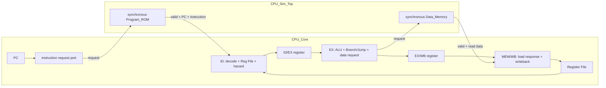
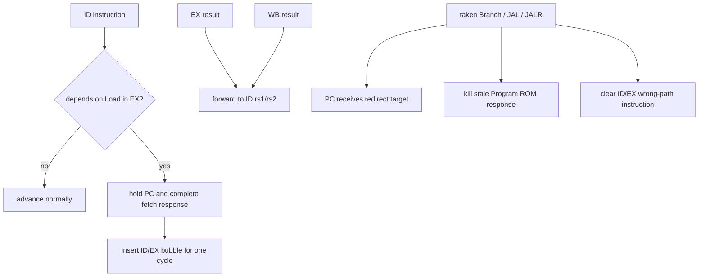

# RV32I 四級管線 CPU

這是一個以 SystemVerilog 從零實作的教學型 RV32I CPU。專案目前使用同步 Instruction Memory 與同步 Data Memory，包含 forwarding、load-use stall、control-flow flush、安全的非法指令處理，以及可逐條比對 architectural effects 的退休（retire）介面。

目前設計適合用來學習 CPU datapath、pipeline control 與驗證方法；它還不是可直接 tape-out 的完整 RISC-V SoC。

RV32I Core v1.0 的完整 ISA、reset、memory、trap 與 retire 契約，以及 40 條指令的逐項驗證矩陣，請見 [`docs/rv32i-core-spec.md`](docs/rv32i-core-spec.md)。該文件描述最終 v1.0 目標；本 README 描述目前已實作狀態。

## 快速開始

開發環境：

- Windows：編輯程式與瀏覽 `index.html`
- WSL：執行 Bash、Icarus Verilog 與測試
- 必要命令：`iverilog`、`vvp`、`python3`
- 程式映像流程另需 RISC-V GNU bare-metal toolchain：`riscv64-unknown-elf-gcc`、`objcopy`、`objdump`、`readelf`、`nm`

在 WSL 中進入專案：

```bash
cd /mnt/d/CodeProject/cpu_build
```

執行完整回歸：

```bash
./run_tests.sh all
```

只執行退休 trace 測試：

```bash
./run_tests.sh retire
```

從 Assembly 建立 ELF/HEX 並執行映像整合測試：

```bash
./run_tests.sh image
```

這條命令會以 `-march=rv32i -mabi=ilp32` 編譯
`programs/image_smoke.S`，產生 ELF、map、objdump、section/symbol report、
IMEM/DMEM HEX，驗證彼此一致後再啟動 CPU simulation。產生的檔案位於
`build/programs/image_smoke/`。

測試成功時 process exit code 為 `0`，並印出 `[PASS]`。整合測試產生的 VCD waveform 位於 `build/`。

若 WSL 尚未安裝 Icarus Verilog，在 Ubuntu／Debian 環境可使用：

```bash
sudo apt update
sudo apt install iverilog
```

## Pipeline 架構

目前是四級、single-issue、in-order pipeline：



`Program_ROM` 的 response register 同時形成 fetch 與 ID 的邊界，因此 `CPU_Core` 不再實例化獨立 `IFID`。`IFID.sv` 仍保留單元測試，作為 pipeline register 練習與未來不同 memory latency 的備選元件。

`CPU_Core` 只包含 datapath、control、pipeline registers 與 Register File，透過明確的 instruction/data request-response ports 存取外部 memory。`CPU_Sim_Top` 接回現有 `Program_ROM` 與 `Data_Memory`；`CPU_Top` 只保留為舊介面的相容 wrapper。正式 synthesis 應以 `CPU_Core` 為 top。

### 每級職責

| Stage | 主要工作 |
|---|---|
| IF | PC 發出 request；同步 Program ROM 保存 response PC、instruction 與 valid |
| ID | 解碼、產生 immediate/control、讀 Register File、套用 EX/WB forwarding、偵測 load-use hazard |
| EX | ALU 運算、effective address、Branch/JAL/JALR redirect、Store data/byte-enable 產生 |
| MEM/WB | 接收同步 Load response、資料擴展與對齊檢查、統一 register writeback、輸出 retire event |

## Stall、forwarding 與 flush



- ALU/JAL/JALR 結果可由 EX 或 WB forwarding 回 ID。
- Load 在 EX 時只有 address，不能當成最終資料 forwarding。
- 緊鄰 Load consumer 會精確 stall 一個 cycle，並保持 PC 與完整 fetch response。
- redirect 優先於一般 PC hold；舊 response 會 invalid，wrong-path 指令不得產生副作用。

## Memory 介面

### Instruction Memory

`Program_ROM.sv` 是 64 words 的可寫模擬模型：

- 一個 clock 的同步 response
- request 由 `fetch_en` 控制
- response 包含 `response_valid`、`response_pc`、`response_inst`
- `fetch_en=0` 時保持整份 response
- reset 或 `kill_response` 使 response invalid
- `kill_response` 與 fetch 同時發生時，kill 優先

一般 CPU 單元／整合 testbench 可在解除 reset 前直接載入
`CPU_Sim_Top.u_Program_Rom.memory[]`；正式程式映像測試則透過
`IMEM_INIT_FILE` 與 `$readmemh` 載入 build script 生成的 HEX。未來替換
SRAM IP 時，只需修改 wrapper 並維持相同 transaction contract，不需修改
`CPU_Core`。

### Data Memory

`Data_Memory.sv` 是固定 4 KiB（1024 × 32-bit）的同步模型：

- 同步 read 與 `read_valid`
- 同步 write
- 4-bit byte enable
- 支援 byte、halfword、word 存取

目前沒有 bus protocol、cache、MMU、memory protection 或 wait-state/backpressure。有效使用範圍是測試模型定義的低位址 memory window。

外部程式映像的正式 ELF/IMEM/DMEM 位址配置與 data rebase 規則記錄於 [`docs/program-image-memory-map.md`](docs/program-image-memory-map.md)。其中 ELF `.data` 使用 `0x1000_0000` 作為封裝 base，但 CPU runtime Data Memory 仍使用低 4 KiB offset。

## 支援的指令

目前 RTL 已實作 RV32I base 的 40 條指令，包含 FENCE、ECALL 與 EBREAK。

| 類型 | 指令 |
|---|---|
| I-type ALU | ADDI, SLTI, SLTIU, XORI, ORI, ANDI, SLLI, SRLI, SRAI |
| R-type ALU | ADD, SUB, SLL, SLT, SLTU, XOR, SRL, SRA, OR, AND |
| U-type | LUI, AUIPC |
| Branch | BEQ, BNE, BLT, BGE, BLTU, BGEU |
| Jump | JAL, JALR |
| Load | LB, LH, LW, LBU, LHU |
| Store | SB, SH, SW |
| Memory ordering | FENCE |
| System trap | ECALL, EBREAK |

未知 opcode 與保留 funct3/funct7 會產生 precise illegal-instruction trap；
faulting instruction 不退休且無 register/memory/control-flow side effect。

## Retire trace

`CPU_Top` 在統一的 EX/WB 觀察點提供：

| Signal | 意義 |
|---|---|
| `retire_valid` | 目前是否有一條合法、未被 flush 的指令退休 |
| `retire_pc` | 該指令的 PC |
| `retire_inst` | 原始 32-bit instruction |
| `retire_rd_write` | 是否真的修改非 x0 register |
| `retire_rd` | 目的 register |
| `retire_rd_data` | register write data |
| `retire_mem_write` | 是否真的提交 Store |
| `retire_mem_addr` | Store address |
| `retire_mem_data` | 已對齊的 Store data |
| `retire_mem_byte_enable` | Store byte lanes |

`tb_CPU_Retire.sv` 會將 12 筆 ordered retire events 與固定 golden trace
逐條比較，另驗證三筆 precise trap。測試包含 ALU、Load/Store、load-use
stall、taken Branch、JAL/JALR、LUI/AUIPC、wrong-path、非法指令及
misaligned access。

目前這是固定程式的 golden trace，不是可執行任意 ELF 的 Spike/QEMU 通用差分測試平台。

## RTL 模組

| 檔案 | 職責 |
|---|---|
| `rtl/CPU_Core.sv` | 可獨立合成的 datapath/control/register file；提供 instruction/data memory transaction ports 與 retire interface |
| `rtl/CPU_Sim_Top.sv` | simulation wrapper；實例化 CPU_Core、Program_ROM、Data_Memory 與集中式 debug helpers |
| `rtl/CPU_Top.sv` | 保留既有外部介面的相容 wrapper；內部轉接 CPU_Sim_Top |
| `rtl/PC.sv` | PC reset、hold 與 next-PC capture |
| `rtl/Program_ROM.sv` | 同步 instruction response model |
| `rtl/Inst_Decoder.sv` | instruction fields 與 I/S/B/U/J immediate |
| `rtl/Control_Unit.sv` | 指令合法性、ALU、operand、branch/jump、Load/Store controls |
| `rtl/Reg_File.sv` | 32 × 32-bit、雙讀單寫、x0 固定為零 |
| `rtl/IDEX.sv` | ID/EX payload、control、PC 與 instruction register |
| `rtl/EXWB.sv` | EX/WB result、memory、PC/instruction 與 retire metadata register |
| `rtl/ALU.sv` | 十種整數 ALU operation |
| `rtl/Branch_Unit.sv` | Branch comparison 與 JAL/JALR target |
| `rtl/Forwarding_Unit.sv` | EX/WB 到 ID 的 rs1/rs2 bypass |
| `rtl/Hazard_Unit.sv` | 精確 load-use dependency detection |
| `rtl/Data_Memory.sv` | 4 KiB 同步 data memory model |
| `rtl/Store_Unit.sv` | Store byte enable、data alignment 與 misalignment detection |
| `rtl/Load_Unit.sv` | Load extraction、sign/zero extension 與 misalignment detection |
| `rtl/Controller.sv` | reset 後的初始化 flush sequence |
| `rtl/IFID.sv` | 已驗證但目前未在 CPU Top 實例化的 IF/ID register |
| `rtl/defines.sv` | opcode、funct 與內部 control constants |

## 測試

`run_tests.sh` 支援以下測試名稱：

| 命令 | 內容 |
|---|---|
| `./run_tests.sh all` | 完整回歸 |
| `./run_tests.sh cpu` | I/R/U-type CPU integration |
| `./run_tests.sh branch` | 六種 Branch 的 taken/not-taken、前後跳與 redirect checks |
| `./run_tests.sh jal` | JAL target、PC+4 link 與 flush |
| `./run_tests.sh jalr` | JALR target、bit 0 clear、forwarding 與非法 funct3 |
| `./run_tests.sh store` | Store sizes、offset、forwarding、misalignment、wrong-path |
| `./run_tests.sh load` | Load sizes、extension、forwarding、misalignment、wrong-path |
| `./run_tests.sh loadhazard` | Load consumer stall/hold/bubble integration |
| `./run_tests.sh illegal` | 非法 instruction 無 register/memory/control-flow 副作用 |
| `./run_tests.sh program` | 四元素 array sum integration program |
| `./run_tests.sh retire` | 12 筆 ordered golden retire trace 與三筆 precise trap |
| `./run_tests.sh image` | `.S → ELF → IMEM/DMEM HEX → artifact verification → CPU simulation` |
| `./run_tests.sh imagetools` | binary-to-word-HEX host-side converter tests |
| `./run_tests.sh directed` | 40/40 traceability matrix + 38 normal instructions directed ELF + ordered retire/signature test |
| `./run_tests.sh programrom` | 同步 fetch response contract |
| `./run_tests.sh hazard` | forwarding integration observation |

其餘單元測試可由腳本的 usage 列表查詢，例如 `pc`、`reg`、`instdecoder`、`idex`、`exwb`、`alu`、`control`、`forwarding`、`hazardunit`、`branchunit`、`memory`、`storeunit`、`loadunit`。

學習進度與各里程碑驗收標準請開啟 `index.html`。

40 條指令逐項的正向、corner、pipeline/control、trap/illegal 與 evidence
記錄於 [`verification/rv32i-directed.csv`](verification/rv32i-directed.csv)。
`directed` regression 會先檢查矩陣完整性與所有 evidence path，再建立並
執行 `programs/rv32i_directed.S`。

## 已知限制

- 已實作 RV32I base 40 條指令；未實作 CSR、privileged architecture 與 interrupt。
- precise synchronous trap 透過外部 ack/redirect contract 處理，沒有 `mtvec`、`mepc`、`mcause` 等 privileged CSR。
- misaligned instruction target 與 Load/Store 會產生 precise trap，但不支援硬體跨 word access。
- Instruction/Data Memory 是 testbench-friendly model，不是 ASIC SRAM macro。
- 沒有 instruction/data bus protocol、cache、MMU 或外部 memory arbitration。
- 沒有可變延遲 memory handshake；目前只支援既定的一個 cycle response contract。
- `Program_ROM` 只有 64 words，`Data_Memory` 只有 4 KiB。
- 已能載入由 Assembly/ELF 產生的 IMEM/DMEM HEX；尚未連接 Spike/QEMU 通用差分測試。
- 尚未進行 lint、CDC、formal verification、synthesis、STA、DFT、place-and-route 或 signoff。

## ASIC 化時的下一層工作

若要往 ASIC 完整流程前進，建議先保持 CPU core 的 transaction contract，再逐步加入：

1. Instruction/Data SRAM wrapper 與 foundry memory macro。
2. 可處理 wait-state 的 request/response handshake。
3. Exception、interrupt、misalignment trap 與 machine-mode CSR。
4. 可載入 ELF 的軟體流程，以及 Spike/QEMU differential testing。
5. Lint、synthesis constraints、STA、formal checks 與 physical-design flow。
